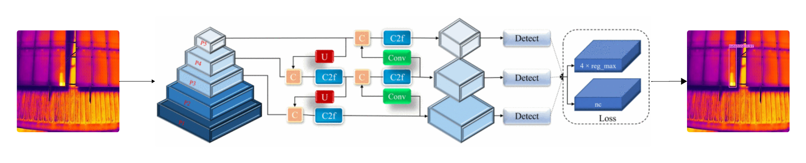

# Design 1: YOLOv8-Based Defect Detection

This notebook documents the implementation, training, and evaluation of **YOLOv8** as **Design 1**.

YOLOv8 was selected due to its strong balance between **detection speed and accuracy**, particularly for small-object detection such as hotspots, shading, and other photovoltaic module defects. Its ability to perform real-time inference on high-resolution thermal images makes it well-suited for solar panel defect detection.

## Design Rationale

YOLOv8 is an optimized single-stage object detection model designed to minimize inference time while maintaining high detection accuracy. Its architecture is particularly effective for detecting small and subtle defects in thermal images, where precision and speed are equally critical.

The evolution of YOLO models up to YOLOv8 introduced improvements in multiscale feature extraction, grid sensitivity, and post-processing through refined non-maximum suppression. These enhancements allow YOLOv8 to consistently detect photovoltaic defects across varying sizes and thermal patterns.

## Model Architecture

YOLOv8 follows a three-part architecture optimized for efficiency and accuracy:

- **Backbone** – Extracts hierarchical spatial features from input images  
- **Neck** – Aggregates multiscale features to handle defects of varying sizes  
- **Head** – Produces bounding box coordinates and class probability predictions  

The multiscale feature representation enables reliable detection of small defects such as hotspots and partial shading.

## Training Process

The model used in this design is **YOLOv8l**, where the *large* variant provides an optimal trade-off between detection accuracy and inference speed.

Training was performed using **pre-trained weights (`yolov8l.pt`)**, which were fine-tuned on the solar module defect dataset to improve domain-specific detection performance. This transfer learning approach accelerates convergence and enhances accuracy.

### Training Configuration

The following parameters were used during training:

- **Epochs:** 50  
- **Batch Size:** 16  
- **Input Image Size:** 640 × 640  
- **Initial Learning Rate:** 0.0005  
- **Final Learning Rate:** 0.01  

These optimization parameters were selected to ensure stable training, effective convergence, and improved generalization across defect classes.

## Sensitivity Analysis Preparation

The final cells of the notebook are dedicated to gathering **additional performance metrics and training parameters** required for **sensitivity analysis**.

## Outcome

YOLOv8 demonstrated strong performance in terms of **accuracy, speed, and robustness**, making it a reliable design alternative for defect detection. It served as a key benchmark for comparison with other designs evaluated in the project.