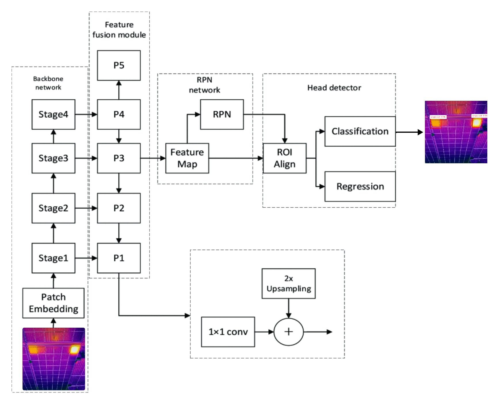

# Design 2: Faster R-CNN-Based Defect Detection

This notebook documents the implementation, training, and evaluation of **Faster R-CNN** as **Design 2**.

Faster R-CNN was selected due to its strong reputation for **high detection accuracy** and precise object localization. While the architecture is more computationally intensive than single-stage detectors, its ability to reliably identify small and subtle defects makes it a viable candidate for solar panel defect detection.

## Design Rationale

Faster R-CNN is a region-based convolutional neural network that prioritizes detection accuracy over inference speed. It improves upon earlier R-CNN variants by integrating a **Region Proposal Network (RPN)** directly into the architecture, allowing regions of interest to be generated from shared feature maps rather than through separate processing steps.

This unified design enhances both localization precision and classification performance, making Faster R-CNN particularly suitable for applications where detection reliability is critical.

## Model Architecture

Faster R-CNN follows a **two-stage detection architecture** designed for precise object identification:

- **Backbone** – Extracts hierarchical feature maps from the input image  
- **Region Proposal Network (RPN)** – Generates candidate regions using anchor boxes across multiple scales and aspect ratios  
- **ROI Pooling** – Aligns proposed regions into a uniform size for processing  
- **Detection Head** – Classifies each region and refines bounding box coordinates  

This staged workflow enables the model to optimize both object classification and localization, resulting in highly accurate predictions.

## Training Process

The Faster R-CNN model was trained to ensure stable convergence while managing the architecture’s computational demands.

### Training Configuration

- **Epochs:** 50  
- **Batch Size:** 2  
- **Input Image Size:** 800 px  
- **Initial Learning Rate:** 0.0002  
- **Final Learning Rate:** 0.002  

The smaller batch size was necessary to accommodate the model’s memory requirements, while the higher image resolution supported improved feature extraction for thermal defect patterns.

### Additional Hyperparameters

Several parameters were configured to optimize detection performance:

- **Anchor Scales:** (8, 16, 32, 64, 128)  
- **Aspect Ratios:** (0.5, 1.0, 2.0)  
- **Weight Decay:** 0.0001  
- **RPN IoU Threshold:** 0.7  
- **ROI IoU Threshold:** 0.5  
- **Score Threshold:** 0.05  

These settings help balance detection sensitivity with precision while reducing overfitting.

## Outcome

Faster R-CNN demonstrated strong localization capability and reliable detection accuracy, validating its effectiveness as a design alternative. However, its higher computational cost and slower inference highlight the trade-off between precision and efficiency when compared to single-stage detectors.