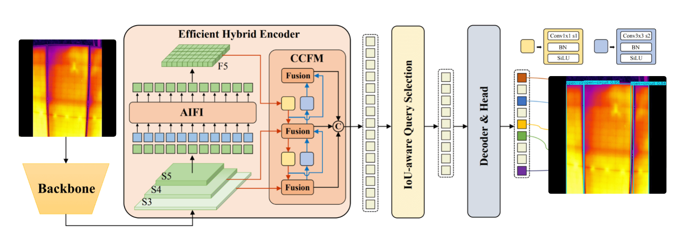

# Design 3: RT-DETR-Based Defect Detection

This notebook documents the implementation, training, and evaluation of **RT-DETR (Real-Time Detection Transformer)** as **Design 3**.

RT-DETR was selected for its ability to balance **real-time detection speed with high accuracy**, making it well-suited for solar panel defect detection where both responsiveness and precision are critical.

## Design Rationale

RT-DETR is an end-to-end object detection architecture derived from the Detection Transformer (DETR). It integrates transformer-based global context modeling with efficient feature encoding to improve both detection performance and inference speed.

A key innovation of RT-DETR is its **efficient hybrid encoder**, which processes multiscale features while decoupling intra-scale and cross-scale interactions. Additionally, **IoU-aware query selection** minimizes uncertainty during object querying, enabling more reliable predictions.

These capabilities position RT-DETR as a strong alternative to traditional CNN-based detectors, particularly in environments requiring accurate detection within time-sensitive workflows.

## Model Architecture

RT-DETR utilizes a transformer-driven pipeline optimized for real-time performance:

- **Backbone (S3–S5)** – Extracts multiscale feature representations from the input image  
- **Hybrid Encoder** – Converts multiscale features into compact image embeddings through intra-scale interaction and cross-scale fusion  
- **IoU-Aware Query Selection** – Chooses high-quality feature queries to guide the detection process  
- **Transformer Decoder** – Iteratively refines object queries to produce bounding boxes and confidence scores  

This architecture enables the model to capture global relationships while maintaining computational efficiency.

## Training Process

The RT-DETR model was trained with optimization strategies designed to maximize performance while respecting hardware constraints.

### Training Configuration

- **Epochs:** 50  
- **Batch Size:** 16  
- **Input Image Size:** 640 px  
- **Initial Learning Rate:** 0.0005  
- **Final Learning Rate:** 0.01  

Mixed precision training (`half=True`) was enabled to reduce GPU memory usage and accelerate training without compromising detection quality.

## Outcome

RT-DETR demonstrated an effective balance between **accuracy, speed, and computational efficiency**, making it highly suitable for real-time solar panel defect detection.